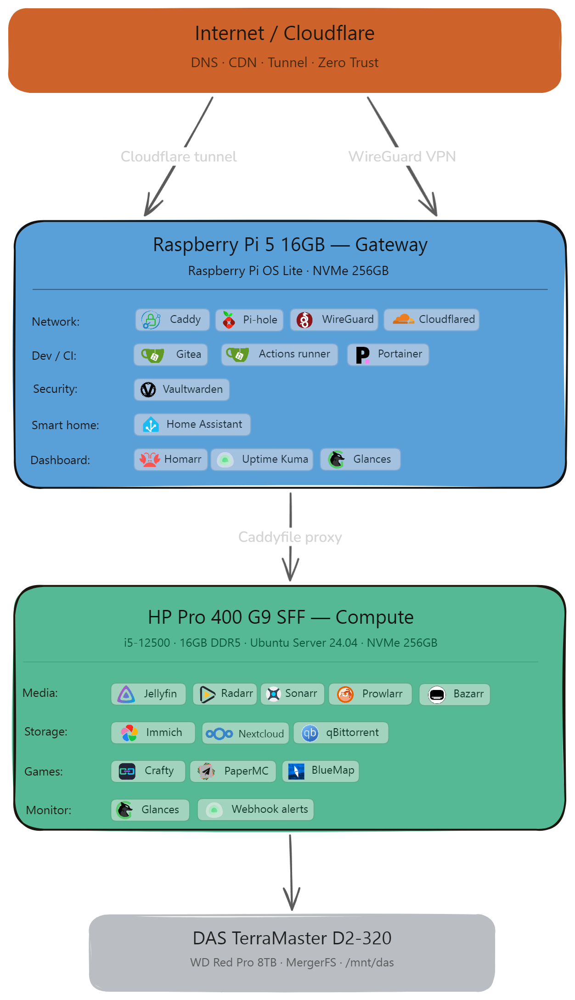
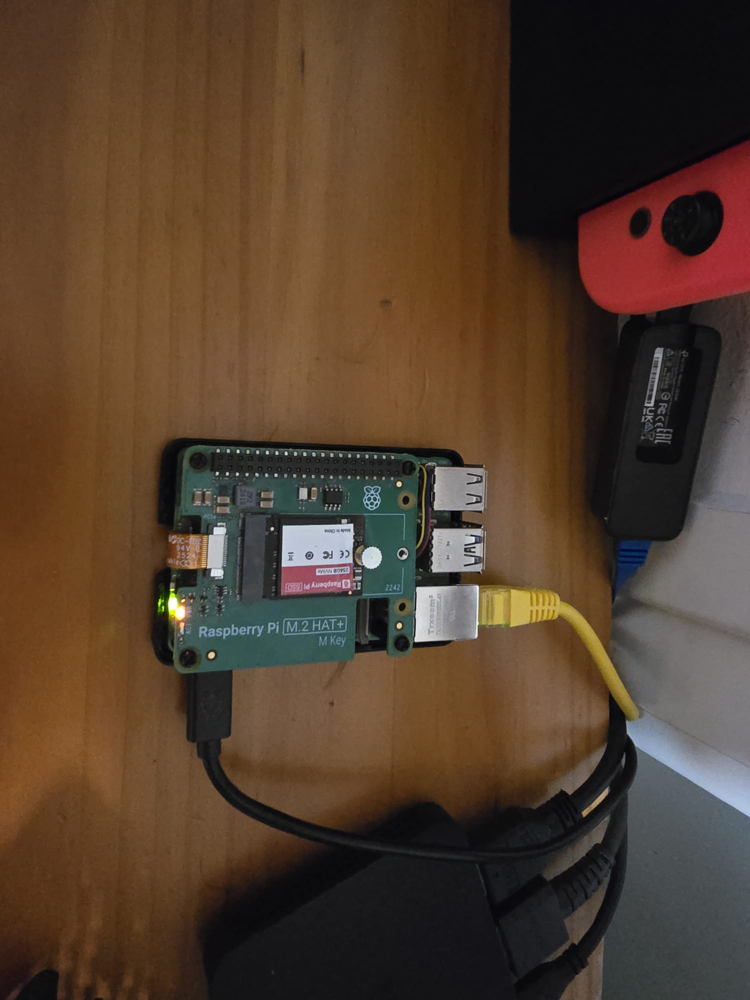
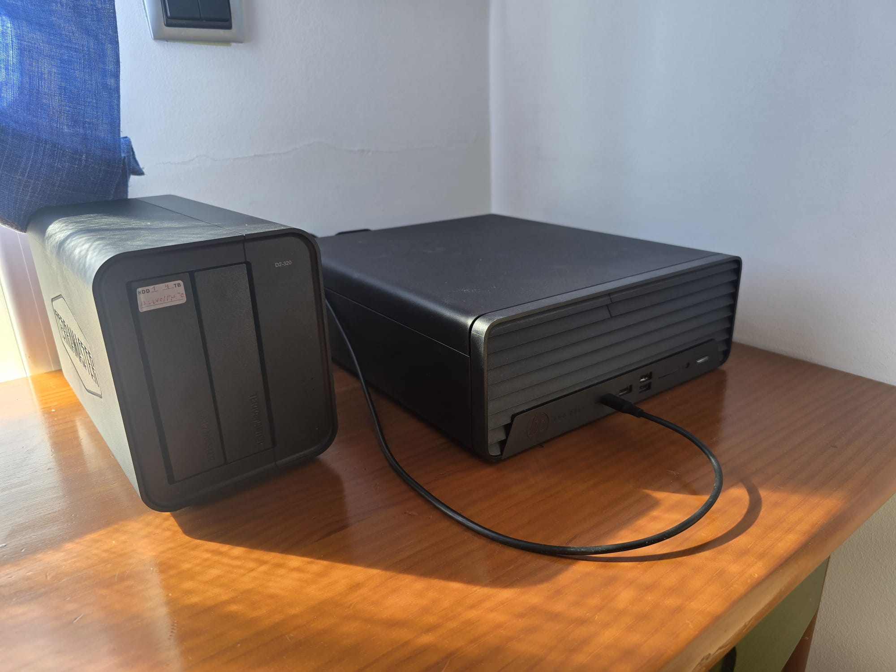
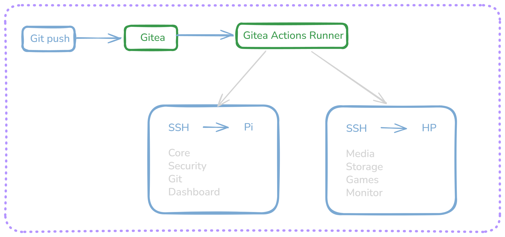
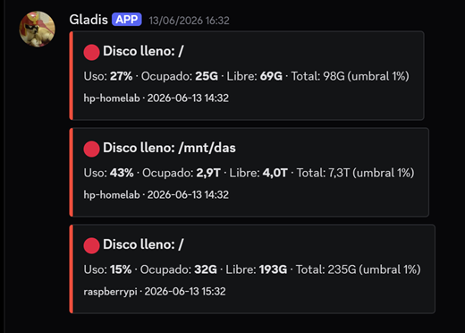
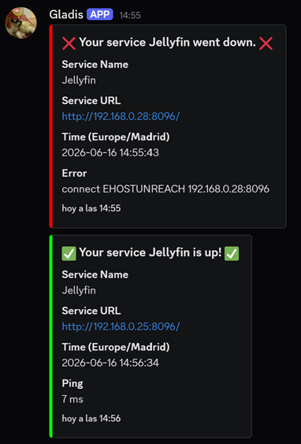
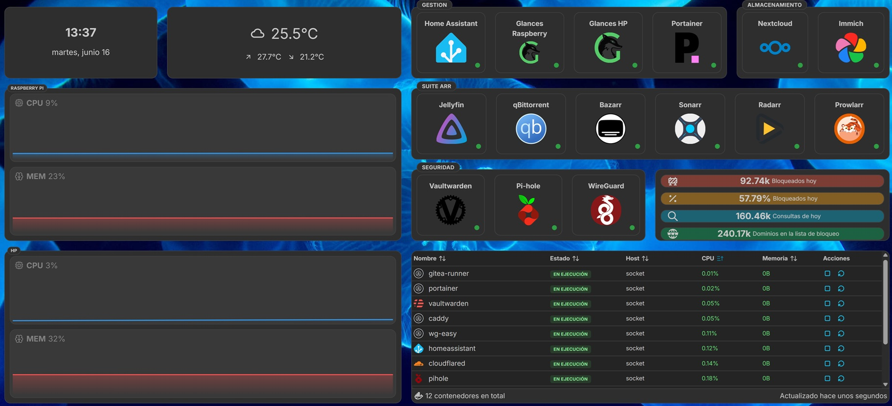

<div align="center">

# Homelab 🏠

**Two-node self-hosted infrastructure — built from scratch, running in production**

[](https://opensource.org/licenses/MIT)
[](#services)
[](#cicd)
[](https://docs.docker.com/compose/)

</div>

---

This repository documents the architecture, services, and operational practices of my homelab. A distributed two-node setup running 23 containerised services behind a self-hosted reverse proxy, with automated deployments, split-horizon DNS, and remote access over WireGuard.

It started with a Raspberry Pi 5, just trying to set up a Minecraft server
for some friends. But little by little I kept finding more things to run on
it and at some point it turned into a small addiction, always looking for
the next service that not only looks cool but actually gives me something
useful and something to learn.

The HP Pro came later. The Pi was struggling with Jellyfin trying to stream
4K and I wanted proper hardware transcoding, the i5-12500 has Intel Quick
Sync which handles that fine. Immich also runs way better on it. When you
upload a large photo library it spends days generating thumbnails and
transcoding every video, and that was hammering the Pi's CPU constantly.
Bigger Minecraft servers too since the Pi was starting to not be enough for
that either. What started as one small board ended up as a two-node setup.

> The operational compose files live in a private Gitea instance.
> This repository contains sanitized versions with all secrets,
> IP addresses and domain names replaced by environment variables.

<br>

## Architecture

<p align="center">
  
</p>

Traffic enters through two paths: a **Cloudflare Tunnel** for the two services exposed without VPN, and **WireGuard** for everything else. Both terminate at the Pi 5, which acts as the network gateway, running the reverse proxy, DNS resolver, VPN endpoint, and CI/CD runner. The HP Pro handles all compute-heavy workloads: media, photo storage, personal cloud, and game servers.

<br>

## Hardware

| Node | Device | CPU | RAM | Storage | Role |
|------|--------|-----|-----|---------|------|
| **Gateway** | Raspberry Pi 5 | Cortex-A76 x4 @ 2.4 GHz | 16 GB | NVMe 256 GB | Network, DNS, VPN, CI/CD, auth |
| **Compute** | HP Pro 400 G9 SFF | Intel i5-12500 (6C/12T) | 16 GB DDR5 | NVMe 256 GB | Media, storage, games |
| **Storage** | TerraMaster D2-320 (DAS) | -- | -- | WD Red Pro 8 TB + Seagate IronWolf 4 TB | Unified via MergerFS, 12 TB raw |

The Pi runs at ~5 W and handles all the core services of the homelab. The HP Pro handles anything CPU or I/O intensive. The DAS connects to the HP via USB-C and holds two drives unified by MergerFS into a single `/mnt/das` volume. Adding or replacing a disk requires no service reconfiguration; MergerFS absorbs the change transparently.

<br>

<p align="center">
  
  
</p>

<sub>The two nodes: Raspberry Pi 5 (gateway) on the left, HP Pro 400 G9 with the DAS (compute + storage) on the right.</sub>

<br>

## Services

### Gateway: Raspberry Pi 5

| Category | Service | Purpose |
|----------|---------|---------|
| **Network** |  [Caddy](https://caddyserver.com) | Reverse proxy, wildcard TLS via DNS-01 |
| |  [Pi-hole](https://pi-hole.net) | DNS resolver, split-horizon, ad blocking |
| |  [WireGuard](https://www.wireguard.com) | VPN for all external access to the network |
| |  [Cloudflared](https://developers.cloudflare.com/cloudflare-one/connections/connect-networks/) | Tunnel for the two public-facing services |
| | [Cloudflare DDNS](https://github.com/favonia/cloudflare-ddns) | Keeps the WAN DNS record in sync with the dynamic public IP |
| **Dev / CI** |  [Gitea](https://gitea.io) | Self-hosted Git |
| | Gitea Actions runner | CI/CD executor that runs deploy workflows |
| |  [Portainer](https://www.portainer.io) | Container management UI |
| **Security** |  [Vaultwarden](https://github.com/dani-garcia/vaultwarden) | Bitwarden-compatible password manager |
| **Smart home** |  [Home Assistant](https://www.home-assistant.io) | Home automation |
| **Dashboard** |  [Homarr](https://homarr.dev) | Service dashboard |
| |  [Uptime Kuma](https://github.com/louislam/uptime-kuma) | Uptime monitoring, alerts to Discord |
| |  [Glances](https://nicolargo.github.io/glances/) | System metrics |

### Compute: HP Pro 400 G9 SFF

| Category | Service | Purpose |
|----------|---------|---------|
| **Media** |  [Jellyfin](https://jellyfin.org) | Media server, hardware transcoding via Quick Sync |
| |  [Radarr](https://radarr.video) / [Sonarr](https://sonarr.tv) | Movie and series management |
| |  [Prowlarr](https://github.com/Prowlarr/Prowlarr) | Indexer aggregator |
| |  [Bazarr](https://www.bazarr.media) | Subtitle management |
| |  [qBittorrent](https://www.qbittorrent.org) | Download client |
| **Storage** |  [Immich](https://immich.app) | Photo and video backup (Google Photos alternative) |
| |  [Nextcloud](https://nextcloud.com) | Personal cloud storage (Google Drive alternative)|
| **Games** |  [Crafty Controller](https://craftycontrol.com) | Minecraft server manager |
| | [PaperMC](https://papermc.io) | High-performance Minecraft server |
| |  [BlueMap](https://bluemap.bluecolored.de) | 3D live map of the Minecraft world |
| **Monitor** |  [Glances](https://nicolargo.github.io/glances/) | System metrics |
| | Webhook alerts | Resource and health alerts via Discord webhooks |

<br>

## CI/CD

All configuration lives in a single `services` repository, mirrored from Gitea to GitHub on every push. Deployments are fully automated, no manual SSH required for routine updates.



The runner lives on the Pi inside the `git` Docker network. On push to `main`, it SSHes into both nodes and runs `docker compose up -d` for each stack. Because Compose is idempotent, only containers with changed configuration restart, everything else keeps running without interruption.

Secrets (SSH deploy key, host addresses) are stored in Gitea's repository secret store, never in the repository itself.

<br>

## Network & Security

Access is layered by sensitivity:

- **Public:** Two services are exposed via Cloudflare Tunnel: Home Assistant and Immich. Some family members access these from their phones without VPN, so Cloudflare handles TLS termination and access without requiring any setup on their side.
- **VPN-only:** Everything else is accessible only over WireGuard. Port `51820/udp` is the only port forwarded on the router.
- **Internal HTTPS:** Caddy terminates TLS for all internal services using a wildcard certificate obtained via DNS-01 challenge. Pi-hole resolves `*.yourdomain` to the Pi's local IP, so no traffic leaves the LAN for internal requests.

Only WireGuard is open to the internet: `51820/udp`. All other services are unreachable from outside the VPN or tunnel.

Secrets are managed per-stack in `.env` files that are gitignored. No credentials appear anywhere in this repository.

## Monitoring

Two layers of monitoring run in parallel. A cron job on both nodes checks disk usage, RAM, CPU load, and temperature every 15 minutes. Uptime Kuma watches every service over HTTP and TCP. Both push to Discord, but only on state transitions, so the channel stays quiet until something actually needs attention.

| Channel | Source | What it reports |
|---------|--------|-----------------|
| `#system` | Cron script | Disk, RAM, CPU, temperature |
| `#services` | Uptime Kuma | Service up/down events |

**System resource alerts**: the cron script reports per-node, per-mount usage. Here it flags disk thresholds on both `hp-homelab` and `raspberrypi`:

<p align="center">
  
</p>

**Service availability alerts**: Uptime Kuma catches a service going down and confirms when it recovers, with response time:

<p align="center">
  
</p>

Because alerts only fire on transitions, a healthy system produces no noise. When something does break, the recovery notification closes the loop automatically.

<br>

## Dashboard

A single Homarr dashboard gives a live view of every service, system metrics for both nodes, and Pi-hole stats.



<br>

## Roadmap

```
Done
    Distributed two-node architecture (Pi gateway + HP compute)
    Self-hosted Git with automated deployments (Gitea Actions)
    Wildcard TLS for all internal services (Caddy + DNS-01)
    Split-horizon DNS (Pi-hole)
    WireGuard VPN + Cloudflare Tunnel
    Discord monitoring (system resources + uptime)
    MergerFS unified storage (WD Red Pro 8 TB + IronWolf 4 TB)
    Nextcloud migrated from SQLite to PostgreSQL

Planned
    Offsite backup with rclone + encryption
    Public Uptime Kuma status page (Just to show off with my friends honestly)


Long term
    Local GPU node for LLM inference (As soon as I get to afford a GPU with enough vram to run properly or I win the lottery)
    Network segmentation (VLANs)
```

<br>

---

<div align="center">
<sub>MIT &copy; 2026 Araanda41</sub>
</div>
